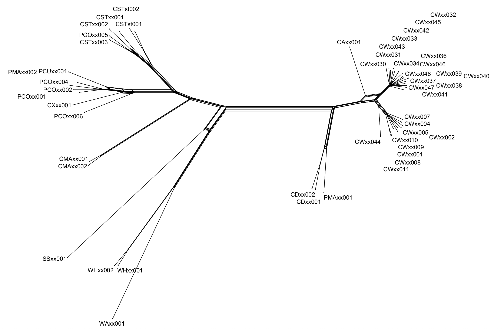

# Caribicus SNP analysis

## Goals

What follows is a filtering protocol and basic analysis of a single nucleotide polymorphism (SNP) dataset from Caribicus and other Hispaniolan galliwasps generated using a genotyping-by-sequencing (GBS) approach. Our goals here are to filter our SNP data, conduct some quality control, and visualize the SNP diversity among the samples. In addition we will conduct some basic analyses involving phylogenetic relationships among taxa including distance based trees and networks and mtulivariate statistics and group assignments of individual samples based on SNP diversity.

## Getting started

We are using *R* version (v) 4.5.2 and *RStudio* v 2026.04.0+526 for the analysis. *Quarto* v 1.6.39 for MacOS was used to document the workflow. Set the working directory in *RStudio* to one where the variant call format (`vcf)` file `Caribicus.variants.vcf` and a `txt` file denoting the identity of the samples is available.

## General Methods Summary

### Generation of SNP data via GBS CHECK METHODS FROM UMGC

Library creation, sequencing, and initial bioinformatics were performed at the University of Minnesota Genomics Center (UMGC). Libraries were sequenced on the Aviti system (Element Biosciences) in single-end, 150bp fragments with medium output targeting approximately 500M reads/run. 56 individual samples were sequenced with 292,222,608 total reads and 5,218,260 reads per sample.

### Assembly and variant calling CHECK METHODS FROM UMGC

Quality for `fastq` files was determined using [*FastQC*](https://github.com/s-andrews/FastQC). Trimming was done using the Perl script [*gbstrim.pl*](https://bitbucket.org/jgarbe/gbstrim). Reads were assembled to a publicly-available reference genome derived from *Heloderma charlesbogerti* (available at NCBI). [@dyson2022] using the Burrows-Wheeler alignment algorithm using maximal exact matches (BWA-MEM). Alignments were saved as binary alignment map (`bam`) files and sorted and indexed in [*Samtools*](https://www.htslib.org/). Variants were called jointly across all samples using the options '`-use-best-n-alleles 4 -min-coverage 112 -limit-coverage 500`' in [*Freebayes*](https://github.com/freebayes/freebayes) [@Garrison2012]. Variants with a quality score over 20 were retained in the `vcf` file generated in *Freebayes* using the option '`-f "QUAL > 20"`'. [Picard](https://broadinstitute.github.io/picard/) was used to summarize alignment rates. Samples with \> 50% missing genotypes and variants with a minor allele frequency (maf) \< 1% and with genotype calls in less than 95% of samples were removed. All these initial assembly, alignment, quality control, and filtering steps were performed at the UMGC. The final unfiltered `vcf` file from UMGC contained 56 samples with 738,455 markers on 194,484 loci.

### Additional filtering and quality control

Additional filtering and data visualization was done on the `Caribicus.variants.vcf` file following the methodology in DeRaad *et al.* [@deraad2023] and DeRaad *et al.* [@deraad2024] using *vcfR* v 1.15.0 [@vcfR] and *SNPfiltR* v 1.0.7 [@SNPfiltR]. The final filtered SNP dataset (`CaribicusSNPs.filtered`) used in subsequent analyses consisted of XX samples (XX low quality samples were excluded) and XX SNPs with XX% missing data.

### General SNP visualization, networks, and trees

A pairwise distance matrix based on Nei's D was generated from the filtered SNP dataset using the R package *StAMPP* v 1.6.3 [@StAMPP] and used to construct a neighbor-net phylogenetic network using *SplitsTreeCE* v 6.1.16 [@Huson1998; @Huson2024; @Bryant2023]. The filtered SNP dataset was converted to a `genlight` object for subsequent analyses using the `vcf2genlight` command in the R package *vcfR* v 1.15.0 [@vcfR]. The R package *Poppr* v 2.9.8 [@poppr] was used to generate a minimum spanning network (MSN) and a distance based tree using the unweighted pair group method (UPGMA). Bootstrapping for the UPGMA tree was performed based on 100 replicates.

### Multivariate analyses

A principal component analysis (PCA) and a discriminant function analysis of principal components (DAPC) was conducted using the R package *adegenet* v 2.1.11 [@adegenet] following the methodology in Jombart *et al.* [@Jombart2010]. DAPC is a multivariate method that takes principal components (PCs) and partitions variance into within- and among-group components in a way that maximizes discrimination among the groups. DAPC makes no explicit assumptions regarding recombination or panmixia. This allows use of the full SNP dataset without additional filtering to reduce the likelihood of linkage as is required for other clustering analyses such as *Structure* [@Pritchard2000; @Porras-Hurtado2013] or *Admixture* [@Alexander2009]. Samples were grouped based on a combination of species, subspecies, and geography and the DAPC analysis was conducted in R based on a tutorial available at <https://grunwaldlab.github.io/Population_Genetics_in_R/DAPC.html>.

PCs were generated using the `glPca` function in *adegenet* v 2.1.11 [@adegenet]. Plots in two dimensions (PCs 1-2) and three dimensions (PCs 1-3) were generated using the R package *plotly* v 4.11.0 [@plotly]. A cross-validation analysis was conducted to determine the optimal number of PCs to be retained in the DAPC by examining the proportion of successful assignments for each PC for the first 50 PCs and 100 replicate runs per PC. We also estimated the the difference between the proportion of successful reassignments using real groups and assignments of individual samples into randomly assigned groups (i.e., the a-score). The mean a-score across replicate runs represents the the average percent improvement in discrimination over that based on random groupings. The `dapc` function in *adegenet* v 2.1.11 [@adegenet] estimated the mean a-score across 30 replictae runs for each of the first 40 PCs. This process was repeated 100 times to generate an optimization graph for each run. The median optimal number of PCs was calculated from these 100 replicates and used in subsequent DAPC analyses.

The DAPC analysis was conducted based on the median optimal number of PCs, determined as described above, in which the posterior membership probability was estimated for each individual sample.

In addition to PCA we conducted a second dimensionality reduction on the SNP data using the uniform manifold projection (UMAP) method. Analysis from both methods allowed for visualization of the SNP data using a linear method emphasizing variation (PCA) and a non-linear method emphasizing global structure among groups (UMAP). UMAP was performed with the `umap` function in the R package *umap* 0.2.10.0 [@umap] and plots were generated in two and three dimensions using the R package *plotly* v 4.11.0 [@plotly].

## Data files

This analysis requires the following data files.

- `Caribicus.variants.vcf` The unfiltered `vcf` file from UMGC.

- `Caribicus_taxa1.txt` The text file containing the individual sample identifications, taxa designations, and localities for each sample represented in the SNP dataset.

## Taxa and populations

For these analyses will be using the tab delimited (`/t`) file `Caribicus_taxa1.txt`.

```         
id  pop locale
CAxx001 C_anelpistus    DR_Altagracia
CDxx001 C_darlingtoni   DR_ValleNuevo
CDxx002 C_darlingtoni   DR_ValleNuevo
CMAxx001    C_macrotus  DR_LomaToro
CMAxx002    C_macrotus  DR_LomaToro
CSTst001    C_stenurus_st   HAITI_Sud
CSTst002    C_stenurus_st   HAITI_Sud
CSTxx001    C_stenurus  DR_MartinGarcia
CSTxx002    C_stenurus  DR_PCamoao
CSTxx003    C_stenurus  DR_Samana
CWxx001 C_warreni_HA    HAITI
CWxx002 C_warreni_HA    HAITI
CWxx003 C_warreni_HA    HAITI
CWxx004 C_warreni_HA    HAITI
CWxx005 C_warreni_HA    HAITI
CWxx006 C_warreni_HA    HAITI
CWxx007 C_warreni_HA    HAITI
CWxx008 C_warreni_HA    HAITI
CWxx009 C_warreni_HA    HAITI
CWxx010 C_warreni_HA    HAITI
CWxx011 C_warreni_HA    HAITI
CWxx030 C_warreni_DR    DR
CWxx031 C_warreni_DR    DR
CWxx032 C_warreni_DR    DR
CWxx033 C_warreni_DR    DR
CWxx034 C_warreni_DR    DR
CWxx036 C_warreni_DR    DR
CWxx037 C_warreni_DR    DR
CWxx038 C_warreni_DR    DR
CWxx039 C_warreni_DR    DR
CWxx040 C_warreni_DR    DR_PPlata
CWxx041 C_warreni_DR    DR_PPlata
CWxx042 C_warreni_DR    DR_PPlata
CWxx043 C_warreni_DR    DR_PPlata
CWxx044 C_warreni_DR    DR_SanJuan
CWxx045 C_warreni_DR    DR_PPlata
CWxx046 C_warreni_DR    DR_PPlata
CWxx047 C_warreni_DR    DR_PPlata
CWxx048 C_warreni_DR    DR_PPlata
CXxx001 C_unknown   DR_PPelempito
PCOxx001    P_costatus  HAITI_Nord
PCOxx002    P_costatus  HAITI_Nord
PCOxx003    P_costatus  DR_SSilencio
PCOxx004    P_costatus  DR_SSilencio
PCOxx005    P_costatus  DR_Haitinen
PCOxx006    P_costatus  DR_LomaToro
PCUxx001    P_curtissi  DR_BocaYuma
PMAxx001    P_marcanoi  DR_Macutico
PMAxx002    P_marcanoi  DR_unkonwn
SSxx001 S_sepsoides DR_Altagracia
WAxx001 W_agasepoides   DR_Pedernales
WHxx001 W_haetinanus    DR_Barahona
WHxx002 W_haetinanus    DR_Barahona
```

## Packages

```{r}
#| label: Install popgenstuff from github
library(devtools)
install_github("gbradburd/popgenstuff")
```

```{r}
#| label: Load package libraries.
library(logr)
library(vcfR)
library(SNPfiltR)
library(StAMPP)
library(poppr)
library(ape)
library(adegenet)
library(vegan)
library(RColorBrewer)
library(popgenstuff)
library(umap)
library(igraph)
library(plotly)
library(htmlwidgets)
library(ggplot2)
library(tidyr)
```

## VCF filtering

Load vcf data

```{r}
#| label: Read in Caribicus vcf data from unfiltered variants file from UMGC
# Load SNPs from vcf file
CaribicusSNPs <- read.vcfR("data/vcf/Caribicus.variants.vcf")
CaribicusSNPs
```

Taxa and populations

Be certain that there is a match between the taxon names in the vcf file and the taxon file. Using the %in% function will run this check irrespective of a different order of the IDs in the two files.

```{r}
#| label: Define taxa and populations
# Define taxa and populations from tab delimited (/t) text file with a header and confirm sample names match the vcf file
# Read taxon file from tab delimited text file
CaribicusTAXA <- read.table("data/taxa/Caribicus_taxa1.txt", sep = "\t", header = TRUE)

#make sure sampling file matches the samples in your vcf
match_result <- CaribicusTAXA$id %in% colnames(CaribicusSNPs@gt)[-1]

# Summary of matching results
match_summary <- table(match_result)
print(match_summary)

# Optionally, check which IDs are not matching
not_matching_samples <- CaribicusTAXA$id[!match_result]
print("Samples not matching:")
print(not_matching_samples)
```

Filters

Minimum depth filter. Although GQ is defined in the VCF header, FreeBayes did not populate per-genotype GQ values in this dataset, so only a depth filter is applied. Genotypes below a read depth of 5 are converted to missing data.

```{r}
#| label: Minimum depth filter
# Hard filter to minimum depth of 5; gq not available in this vcf
CaribicusSNPs <- hard_filter(vcfR = CaribicusSNPs, depth = 5)
```

Remove any loci with \> 2 alleles.

```{r}
#| label: Include only biallelic sites
# Remove loci with > 2 alleles
CaribicusSNPs <- filter_biallelic(CaribicusSNPs)
```

```{r}
#| label: Allele balance filter
#execute allele balance filter
CaribicusSNPs <- filter_allele_balance(CaribicusSNPs, min.ratio = .10, max.ratio = .90)
```

Max depth filter excludes very high depth loci that could be multiple loci combined into a single paralog.

```{r}
#| label: Maximum depth filter
# visualize and select the maximum depth cutoff
CaribicusSNPs <- max_depth(CaribicusSNPs, maxdepth = 200)
```

Remove invariant SNPs after initial filtering and summarize the resulting dataset.

```{r}
#| label: Remove invariant SNPs after filtering
# removing invariant SNPs (min.mac = 1)
CaribicusSNPs <- min_mac(CaribicusSNPs, min.mac = 1)
CaribicusSNPs
```

Missing data by sample

Which samples to keep in downstream analyses

```{r}
#| label: Visualize missing data by sample
# Missing data by sample and by SNP
miss <- missing_by_sample(CaribicusSNPs)
```

Exclude samples with a comparatively high proportion of missing data.

```{r}
#| label: Exclude samples with too much missing data
# Use the missing_by_sample function to exclude samples with greater than 65% missing data based on prior visualizations
CaribicusSNPs.filtered <- missing_by_sample(vcfR = CaribicusSNPs, cutoff = 0.65)
# Remove any invariant sites created from sample filtering
CaribicusSNPs.filtered <- min_mac(CaribicusSNPs.filtered, min.mac = 1)
```

List the samples retained and excluded by the missing data filter.

```{r}
#| label: List included and excluded samples
# Samples retained after filtering
included <- colnames(CaribicusSNPs.filtered@gt)[-1]
cat("Samples retained (", length(included), "):\n", sep = "")
print(included)

# Samples excluded by the filter
excluded <- setdiff(colnames(CaribicusSNPs@gt)[-1], included)
cat("\nSamples excluded (", length(excluded), "):\n", sep = "")
print(excluded)
```

Verify that missing data is not driving clustering patterns among the retained samples. The taxon file is first subsetted to match only the samples retained after filtering.

```{r}
#| label: Verify missing data not driving clustering after sample filtering
# Subset CaribicusTAXA to only include retained samples
CaribicusTAXA.filtered <- CaribicusTAXA[CaribicusTAXA$id %in% colnames(CaribicusSNPs.filtered@gt)[-1], ]
# Verify missing data is not driving clustering patterns
miss <- assess_missing_data_pca(vcfR = CaribicusSNPs.filtered, popmap = CaribicusTAXA.filtered,
                                thresholds = 0.5, clustering = FALSE)
```

Set the threshold for SNPs

```{r}
#| label: Visualizing SNP missing data
# Use the missing_by_snp function to identify the effect of filtering dataset on the proportion of missing data and visualize the amount of missing data by sample
by.snp <- missing_by_snp(CaribicusSNPs.filtered)
miss <- missing_by_sample(CaribicusSNPs.filtered)
```

Assess clustering patterns at a range of per-SNP completeness thresholds to inform selection of the final cutoff.

```{r}
#| label: Assess missing data PCA at multiple SNP thresholds
# Verify that missing data is not driving clustering patterns at 70%, 80%, and 90% completeness thresholds
miss <- assess_missing_data_pca(vcfR = CaribicusSNPs.filtered, popmap = CaribicusTAXA.filtered,
                                thresholds = c(0.7, 0.8, 0.9), clustering = FALSE)
```

Conduct an exploratory visualization based on proportion of missing SNP data.

```{r}
#| label: Missing by SNP exploratory
missing_by_snp(CaribicusSNPs.filtered)
```

Retain SNPs present in at least 90% of samples using a completeness threshold of 0.9 in the `missing_by_snp()` argument. Visualize missing data per sample using the `missing_by_sample()` function and identify any individual samples with disproportionately high levels of missing data following SNP filtering.

```{r}
#| label: Set 90% completeness threshold
# png/dev.off used to suppress internal plot generated by missing_by_snp() during Quarto rendering
png(tempfile(), width = 8, height = 6, units = "in", res = 150)
CaribicusSNPs.filtered <- missing_by_snp(CaribicusSNPs.filtered, cutoff = 0.9)
dev.off()
CaribicusSNPs.filtered
```

```{r}
#| label: Missing by sample visualization
#| warning: false
#| message: false
missing_by_sample(CaribicusSNPs.filtered)
```

With this filtering scheme the final SNP dataset has 50 samples (3 excluded), 24,902 SNPs, and 3.28% missing data.

```{r}
#| label: Summary of final filtered SNP dataset
CaribicusSNPs.filtered
```

```{r}
#| label: List included and excluded samples after all filtering
# Samples retained after all filtering
included <- colnames(CaribicusSNPs.filtered@gt)[-1]
cat("Samples retained (", length(included), "):\n", sep = "")
print(included)

# Samples excluded relative to the original vcf
excluded <- setdiff(colnames(CaribicusSNPs@gt)[-1], included)
cat("\nSamples excluded (", length(excluded), "):\n", sep = "")
print(excluded)
```

Investigate the effect of a minor allele count (MAC) cutoff on the dataset. Following Linck and Battey [-@Linck2019], filtering by count rather than frequency is preferred when missing data varies across loci, as a static frequency cutoff will remove different site frequency spectrum classes at different sites. Here we visualize the effect of removing singletons (min.mac = 2) without yet committing to a final MAC cutoff.

```{r}
#| label: Investigate minor allele count cutoff
# Visualize the effect of removing singletons (min.mac = 2)
CaribicusSNPs.filtered.mac2 <- min_mac(CaribicusSNPs.filtered, min.mac = 2)
CaribicusSNPs.filtered.mac2
```

Convert the filtered vcf file to a genlight object, assign populations, produce a pairwise divergence matrix, and a network using splitstree.

```{r}
#| label: Convert to genlight object and generate matrix and network
# Convert to genlight
CaribicusSNPs.gen <- vcfR2genlight(CaribicusSNPs.filtered)
# Assign populations
CaribicusSNPs.gen@pop <- as.factor(CaribicusSNPs.gen@ind.names)
# Generate pairwise matrix
sample.div <- stamppNeisD(CaribicusSNPs.gen, pop = FALSE)
#export for splitstree
stamppPhylip(distance.mat = sample.div, file = "CaribicusSNPs.filtered.90.splits.txt")
```



Check for overlapping SNPs.

```{r}
#| label: Removing overlapping SNPs
df <- as.data.frame((CaribicusSNPs.filtered@fix[,1:2]))
nrow(df) - length(unique(paste(df$CHROM,df$POS)))
```

Visualize depth of all retained genotypes. Genotype quality is not available in this vcf. Although GQ is defined in the VCF header, FreeBayes did not populate per-genotype GQ values in this dataset, so visualization of genotype quality by SNP and sample is not possible.

```{r}
#| label: Depth per SNP and per sample
dp <- extract.gt(CaribicusSNPs.filtered, element = "DP", as.numeric = TRUE)
heatmap.bp(dp, rlabels = FALSE)
```

## SNP analyses

### Preparing the filtered dataset

Write the filtered SNP dataset to a `vcf` file for use in downstream analyses outside of R. Note that `vcfR::write.vcf()` automatically produces a gzipped file so the output will be `Caribicus.variants.filtered.vcf.gz`.

```{r}
#| label: Write filtered vcf
vcfR::write.vcf(CaribicusSNPs.filtered, file = "data/vcf/Caribicus.variants.filtered.vcf.gz")
```

Extract allelic states from the filtered SNP dataset and estimate Watterson's θ [@watterson1975] using the package [popgenstuff](https://rdrr.io/github/gbradburd/popgenstuff/man/calcThetaW.html). This calculation includes only polymorphic sites.

```{r}
#| label: Estimate theta
CaribicusSNPsgt <- extract.gt(CaribicusSNPs.filtered)
calcThetaW(CaribicusSNPsgt)
```

Convert the filtered VCF to a genlight object, set ploidy to 2 for these diploid organisms, and assign taxa from the `pop` column of the taxon file. The `match()` function ensures population assignments are ordered correctly relative to the genlight individual order regardless of sample ordering in the taxon file.

```{r}
#| label: Convert to genlight and assign populations
gl.CaribicusSNPs <- vcfR2genlight(CaribicusSNPs.filtered)
ploidy(gl.CaribicusSNPs) <- 2
pop(gl.CaribicusSNPs) <- CaribicusTAXA.filtered$pop[match(indNames(gl.CaribicusSNPs), CaribicusTAXA.filtered$id)]
```

### Color settings

Define the color schema to be used throughout the figures for each taxon. The Caribicus dataset includes 13 taxa so the 11-color palette from the Zosterops analysis has been extended with two additional colors.

```{r}
#| label: Color settings
ColorPal_CUSTOM <- c("#004949", "#DB6D00", "#D82632", "#290AD8", "#FED439",
                     "#B66DFF", "#006DDB", "#FA9C88", "#924900",
                     "#7BA9CB", "#008600", "#FF6984", "#5C3317", "#1CE6FF")
# 14 colors for 14 taxa. Colors 7 (#006DDB) and 8 (#FA9C88) are assigned to
# C_warreni_DR and C_warreni_HA respectively; adjust these to related shades
# if desired to visually indicate the two groups belong to the same species.
```

### Minimum spanning network (MSN)

Create a minimum spanning network (MSN). Export the figure as either a `pdf` or `png` file using the export function in RStudio. Setting `inds` to a blank space and `nodelab` to an arbitrarily large number leaves blank unlabeled points on the network; removing these arguments labels each point with the corresponding sample name.

```{r}
#| label: MSN seed
MSNseed = sample(1:999, 1)
print(MSNseed)
```

```{r}
#| label: Minimum spanning network
#| fig-width: 20
#| fig-height: 15
set.seed(MSNseed)
CaribicusSNPsDist <- bitwise.dist(gl.CaribicusSNPs)
CaribicusSNPsMSN <- poppr.msn(gl.CaribicusSNPs, CaribicusSNPsDist, showplot = FALSE, include.ties = TRUE)
node.size <- rep(3.5, times = nInd(gl.CaribicusSNPs))
names(node.size) <- indNames(gl.CaribicusSNPs)
vertex.attributes(CaribicusSNPsMSN$graph)$size <- node.size
plot_poppr_msn(gl.CaribicusSNPs, CaribicusSNPsMSN, palette = ColorPal_CUSTOM, gadj = 70, label.cex = 8, pop.leg = TRUE, size.leg = FALSE, inds = " ", nodelab = 100000, vertex.label.cex = 2)
```

### Distance tree

Create a distance tree based on the unweighted pair group method with arithmetic mean (UPGMA). Export the figure as either a `pdf` or `png` file using the export function in RStudio.

```{r}
#| label: Distance tree UPGMA
CaribicusSNPsDTree <- aboot(gl.CaribicusSNPs, tree = "upgma", distance = bitwise.dist, sample = 100, showtree = FALSE, cutoff = 50, quiet = FALSE)
```

```{r}
#| label: Plot distance tree
#| fig-width: 27
#| fig-height: 24
plot.phylo(CaribicusSNPsDTree, cex = 2.5, font = 3, adj = 0)
nodelabels(CaribicusSNPsDTree$node.label, adj = c(1.3, -0.5), frame = "n", cex = 2.5, font = 3, xpd = TRUE)
axis(side = 1, cex.axis = 2)
title(xlab = "Genetic distance (proportion of loci that are different)", cex.lab = 2)
```

### Principal component analysis (PCA)

Conduct a principal component analysis (PCA) on the `gl.CaribicusSNPs` object. Graph the percent of variance explained by each principal component (PC) and create a two-dimensional plot with PC1 and PC2 and a three-dimensional plot with PC1, PC2, and PC3.

```{r}
#| label: PCA seed
PCAseed = sample(1:999, 1)
print(PCAseed)
```

```{r}
#| label: Run PCA and plot eigenvalues
set.seed(PCAseed)
CaribicusSNPsPCA <- glPca(gl.CaribicusSNPs, nf = 5)
CaribicusSNPs_PCA_VARexp <- (100*CaribicusSNPsPCA$eig/sum(CaribicusSNPsPCA$eig))
barplot(100*CaribicusSNPsPCA$eig/sum(CaribicusSNPsPCA$eig), col = heat.colors(200), main = "PCA Eigenvalues", ylim = c(0,30), cex.axis = 1.4)
title(ylab = "Percent of variance explained", line = 2, cex.lab = 1.4)
title(xlab = "Eigenvalues", line = 2, cex.lab = 1.4)
```

```{r}
#| label: PCA 2D and 3D plots
CaribicusSNPsPCAscores <- as.data.frame(CaribicusSNPsPCA$scores)
CaribicusSNPsPCAscores$pop <- pop(gl.CaribicusSNPs)
PCAplot <- CaribicusSNPsPCAscores
levels(PCAplot$pop)[levels(PCAplot$pop)=="C_anelpistus"] <- "C. anelpistus"
levels(PCAplot$pop)[levels(PCAplot$pop)=="C_darlingtoni"] <- "C. darlingtoni"
levels(PCAplot$pop)[levels(PCAplot$pop)=="C_macrotus"] <- "C. macrotus"
levels(PCAplot$pop)[levels(PCAplot$pop)=="C_stenurus_st"] <- "C. stenurus sticticeps"
levels(PCAplot$pop)[levels(PCAplot$pop)=="C_stenurus"] <- "C. stenurus"
levels(PCAplot$pop)[levels(PCAplot$pop)=="C_warreni_DR"] <- "C. warreni (DR)"
levels(PCAplot$pop)[levels(PCAplot$pop)=="C_warreni_HA"] <- "C. warreni (Haiti)"
levels(PCAplot$pop)[levels(PCAplot$pop)=="C_unknown"] <- "C. sp."
levels(PCAplot$pop)[levels(PCAplot$pop)=="P_costatus"] <- "P. costatus"
levels(PCAplot$pop)[levels(PCAplot$pop)=="P_curtissi"] <- "P. curtissi"
levels(PCAplot$pop)[levels(PCAplot$pop)=="P_marcanoi"] <- "P. marcanoi"
levels(PCAplot$pop)[levels(PCAplot$pop)=="S_sepsoides"] <- "S. sepsoides"
levels(PCAplot$pop)[levels(PCAplot$pop)=="W_agasepoides"] <- "W. agasepoides"
levels(PCAplot$pop)[levels(PCAplot$pop)=="W_haetinanus"] <- "W. haetinanus"
names(PCAplot)[names(PCAplot)=="pop"] <- "Taxon"
PC2Dplot <- plot_ly(x = PCAplot$PC1, y = PCAplot$PC2, type = "scatter", mode = 'markers',
        marker = list(size = 10, line = list(width = 1, color = 'black')),
        color = PCAplot$Taxon,
        colors = ColorPal_CUSTOM) %>%
  layout(xaxis = list(title = 'PC1'), yaxis = list(title = 'PC2'))
PC3Dplot <- plot_ly(x = PCAplot$PC1, y = PCAplot$PC2, z = PCAplot$PC3, type = "scatter3d", mode = 'markers',
        marker = list(size = 10, line = list(width = 1, color = 'black')),
        color = PCAplot$Taxon,
        colors = ColorPal_CUSTOM) %>%
  layout(scene = list(xaxis = list(title = 'PC1'),
                      yaxis = list(title = 'PC2'),
                      zaxis = list(title = 'PC3')))
PC2Dplot
```

```{r}
#| label: 3D PCA plot
PC3Dplot
```

```{r}
#| label: PCA variance explained
CaribicusSNPs_PCA_VARexp[1:5]
```

Calculate the centroids for each group based on the first three principal components and the pairwise Euclidean distances between each pair of groups.

```{r}
#| label: PCA centroids
Caribicus_PCAscores <- CaribicusSNPsPCA$scores[, 1:3]
Caribicus_PCAgroups <- gl.CaribicusSNPs@pop
Caribicus_PCAdf <- data.frame(Caribicus_PCAscores, Group = Caribicus_PCAgroups)
Caribicus_unique_PCAgroups <- unique(Caribicus_PCAgroups)
Caribicus_PCAcentroids <- data.frame(Group = character(), PC1 = numeric(), PC2 = numeric(), PC3 = numeric(), stringsAsFactors = FALSE)
# Loop through each unique group to calculate centroids
for (group in Caribicus_unique_PCAgroups) {
  group_scores <- Caribicus_PCAdf[Caribicus_PCAdf$Group == group, 1:3]
  centroid <- colMeans(group_scores, na.rm = TRUE)
  Caribicus_PCAcentroids <- rbind(Caribicus_PCAcentroids,
                                   data.frame(Group = group,
                                              PC1 = centroid[1],
                                              PC2 = centroid[2],
                                              PC3 = centroid[3]))
}
print(Caribicus_PCAcentroids)
```

```{r}
#| label: Euclidean distances between centroids
# Calculate the Euclidean distances between centroids
Caribicus_PCAdistance_matrix <- as.matrix(dist(Caribicus_PCAcentroids[, 2:4]))
Caribicus_PCAdistance_df <- as.data.frame(Caribicus_PCAdistance_matrix)
rownames(Caribicus_PCAdistance_df) <- Caribicus_PCAcentroids$Group
colnames(Caribicus_PCAdistance_df) <- Caribicus_PCAcentroids$Group
print(Caribicus_PCAdistance_df)
```

```{r}
#| label: Plot PCA scores with centroids
Caribicus_PCAcentroids_plot <- ggplot(Caribicus_PCAdf, aes(x = PC1, y = PC2, color = Group)) +
  geom_point(alpha = 0.6) +
  geom_point(data = Caribicus_PCAcentroids, aes(x = PC1, y = PC2),
             color = "black", size = 3, shape = 3) +
  labs(title = "PCA of Caribicus SNPs", x = "PC1", y = "PC2") +
  scale_color_manual(values = ColorPal_CUSTOM) +
  theme_minimal()
print(Caribicus_PCAcentroids_plot)
```

## Uniform manifold approximation and projection (UMAP)

Uniform manifold approximation and projection (UMAP) is a non-linear, stochastic algorithm to reduce dimensionality for visualization of multivariate data. UMAP seeks to preserve as much of the relationships among groups in the dataset as possible while reducing to a minimal number of components. The SNP data is visualized with UMAP in two and three dimensions using the `umap` package and the results plotted using the `plot_ly` command from the `plotly` package. The `n_neighbors`, `min_dist`, and `metric` arguments reflect the default values. For each plot save as `html` files using the `saveWidget` command in the `htmlwidgets` package.

```{r}
#| label: UMAP seed
UMAPseed = sample(1:999, 1)
print(UMAPseed)
```

```{r}
#| label: UMAP 2D
set.seed(UMAPseed)

# Use same color palette as other analyses
ColorPal_UMAP <- ColorPal_CUSTOM

# Extract SNP data
CaribicusSNPs_UMAP <- as.data.frame(tab(gl.CaribicusSNPs))

# Run 2D UMAP
CaribicusUMAP_results <- umap(CaribicusSNPs_UMAP, n_neighbors = 15, min_dist = 0.1, metric = 'euclidean')
CaribicusUMAP_df <- as.data.frame(CaribicusUMAP_results$layout)
CaribicusUMAP_df$Taxon <- pop(gl.CaribicusSNPs)
CaribicusUMAP_2Dplot <- plot_ly(data = CaribicusUMAP_df, x = ~V1, y = ~V2, type = 'scatter', mode = 'markers',
                     marker = list(size = 15, line = list(width = 1, color = 'black')),
                     color = ~Taxon, colors = ColorPal_UMAP) %>%
  layout(xaxis = list(title = 'UMAP 1'),
         yaxis = list(title = 'UMAP 2'))
CaribicusUMAP_2Dplot
```

```{r}
#| label: UMAP 2D data frame
CaribicusUMAP_df
```

```{r}
#| label: UMAP 3D
CaribicusUMAP_3Dresults <- umap(CaribicusSNPs_UMAP, n_neighbors = 15, min_dist = 0.1, metric = 'euclidean', n_components = 3)
CaribicusUMAP_3Ddf <- as.data.frame(CaribicusUMAP_3Dresults$layout)
CaribicusUMAP_3Ddf$Taxon <- pop(gl.CaribicusSNPs)
CaribicusUMAP_3Dplot <- plot_ly(data = CaribicusUMAP_3Ddf, x = ~V1, y = ~V2, z = ~V3, type = 'scatter3d', mode = 'markers',
                        marker = list(size = 10, line = list(width = 1, color = 'black')),
                        color = ~Taxon, colors = ColorPal_UMAP) %>%
  layout(scene = list(xaxis = list(title = 'UMAP 1'),
                      yaxis = list(title = 'UMAP 2'),
                      zaxis = list(title = 'UMAP 3')))
CaribicusUMAP_3Dplot
```

```{r}
#| label: UMAP 3D data frame
CaribicusUMAP_3Ddf
```

```{r}
#| label: Export UMAP plots as html widgets
saveWidget(CaribicusUMAP_2Dplot, file = "CaribicusUMAP_2Dplot.html")
saveWidget(CaribicusUMAP_3Dplot, file = "CaribicusUMAP_3Dplot.html")
```

```{r}
#| label: Export PCA plots as html widgets
saveWidget(PC2Dplot, file = "Caribicus2DPCAplot.html")
saveWidget(PC3Dplot, file = "Caribicus3DPCAplot.html")
```

## Discriminant analysis of principal components (DAPC)

A discriminant analysis of principal components (DAPC) partitions variance into within- and among-group components and estimates posterior probabilities of group membership for each individual sample. Determining the optimal number of PCs to retain is critical: retaining too few underfits the data while retaining too many can lead to over-fitting. Two complementary approaches are used here to determine the optimal number of PCs. First, a cross-validation analysis (`xvalDapc`) examines the proportion of successful assignments across the first 50 PCs using 100 replicate runs per PC. Second, the *a*-score is estimated as the difference between the proportion of successful reassignments using the real group structure versus randomly assigned groups; the mean *a*-score across replicate runs is the average percent improvement in discrimination over random. The `optim.a.score` function in *adegenet* v 2.1.11 [@adegenet] iterates over the first 40 PCs to identify the number of PCs that maximizes the *a*-score. This optimization is repeated 100 times and the median optimal number of PCs across all replicates is used in the final DAPC.

### Cross-validation

```{r}
#| label: DAPC cross-validation seed
xvalDAPCseed = sample(1:999, 1)
print(xvalDAPCseed)
```

Cross-validation (`xvalDapc`) examines the proportion of successful assignments across the first 50 PCs using 100 replicate runs per PC. This step is computationally intensive and is set to `eval: false` after the first run; the seed is saved above so results are reproducible.

```{r}
#| label: DAPC cross-validation
#| eval: false
set.seed(xvalDAPCseed)
CaribicusSNPs_xval <- xvalDapc(tab(gl.CaribicusSNPs, NA.method = "mean"), pop(gl.CaribicusSNPs),
                               n.pca = 1:50, n.rep = 100, parallel = "multicore", ncpus = 6L)
xval_success <- CaribicusSNPs_xval[["Mean Successful Assignment by Number of PCs of PCA"]]
xval_df <- data.frame(
  n.pca   = as.integer(names(xval_success)),
  success = as.numeric(xval_success)
)
ggplot(xval_df, aes(x = n.pca, y = success)) +
  geom_line() + geom_point() +
  labs(x = "Number of PCs retained", y = "Mean successful assignment (%)",
       title = "DAPC cross-validation") +
  theme_minimal()
```

```{r}
#| label: DAPC cross-validation results
#| eval: false
CaribicusSNPs_xval[-1]
```

### *A*-score estimation

The *a*-score is estimated across 30 replicate randomizations for each of the first 40 PCs. This gives an initial picture of which PC range maximizes discriminatory power before the full 100-replicate optimization.

```{r}
#| label: DAPC a-score seed
ascoreDAPCseed = sample(1:999, 1)
print(ascoreDAPCseed)
```

```{r}
#| label: DAPC a-score estimation
set.seed(ascoreDAPCseed)
CaribicusSNPsDAPC_ascoretest <- dapc(gl.CaribicusSNPs, n.pca = 10, n.da = nPop(gl.CaribicusSNPs) - 1)
CaribicusSNPsDAPC_ascore <- a.score(CaribicusSNPsDAPC_ascoretest, n.sim = 30)
CaribicusSNPsDAPC_ascore$mean
```

Approximately 58.74% better than random with ten PCs.

### *A*-score optimization

The `optim.a.score` function is called 100 times to determine the median optimal number of PCs. This loop is computationally intensive and set to `eval: false` after the first run; results are written to file and read back in the next block.

```{r}
#| label: DAPC a-score optimization loop
#| cache: true
OptimumPC_list <- c()
for (i in 1:100) {
  optDAPCseed = sample(1:999, 1)
  set.seed(optDAPCseed)
  CaribicusSNPsDAPC_ascoretest <- dapc(gl.CaribicusSNPs, n.pca = 20, n.da = nPop(gl.CaribicusSNPs) - 1)
  CaribicusSNPsDAPC_optim <- optim.a.score(CaribicusSNPsDAPC_ascoretest, n.sim = 30, plot = FALSE)
  OptimumPC_list <- c(OptimumPC_list, CaribicusSNPsDAPC_optim$best)
}
write.table(OptimumPC_list, file = "CaribicusSNPs_OptimumPC_list.txt", row.names = FALSE, col.names = FALSE)
OptimumPC_median <- median(OptimumPC_list)
print(OptimumPC_list)
print(paste("Median optimal number of PCs:", OptimumPC_median))
hist(OptimumPC_list, main = "Optimal number of PCs (100 replicates)",
     xlab = "Number of PCs", col = "lightblue", breaks = 20)
```

### DAPC analysis

Conduct the DAPC using the median optimal number of PCs identified above. Generate a loading plot showing the contribution of each SNP to the discriminant functions, a scatter plot of the DAPC results, and a bar plot of the posterior membership probabilities for each individual sample. Export the loading plot, scatter plot, and bar plot as `pdf` files, and produce a summary table of the results.

```{r}
#| label: DAPC seed
DAPCseed = sample(1:999, 1)
print(DAPCseed)
```

```{r}
#| label: Run DAPC
set.seed(DAPCseed)
CaribicusSNPsDAPC <- dapc(gl.CaribicusSNPs, n.pca = OptimumPC_median, n.da = nPop(gl.CaribicusSNPs) - 1)
```

```{r}
#| label: DAPC loading plot
CaribicusSNPsDAPC_contributions <- loadingplot(CaribicusSNPsDAPC$var.contr, axis = 2,
                                               thres = 0.0025, lab.jitter = 1)
```

```{r}
#| label: DAPC scatter plot
#| fig-width: 10
#| fig-height: 8
DAPCscatter <- scatter(CaribicusSNPsDAPC, col = ColorPal_CUSTOM, cex = 3, legend = TRUE,
                       clabel = FALSE, posi.leg = "bottomleft", scree.pca = TRUE,
                       posi.pca = "topright", cleg = 0.75)
DAPCscatter
```

```{r}
#| label: DAPC bar plot
#| fig-width: 14
#| fig-height: 6
CaribicusSNPsDAPCResults <- as.data.frame(CaribicusSNPsDAPC$posterior)
CaribicusSNPsDAPCResults$pop <- pop(gl.CaribicusSNPs)
CaribicusSNPsDAPCResults$indNames <- rownames(CaribicusSNPsDAPCResults)
CaribicusSNPsDAPCResults <- pivot_longer(CaribicusSNPsDAPCResults, -c(pop, indNames))
colnames(CaribicusSNPsDAPCResults) <- c("Original_Pop", "Sample", "Assigned_Pop", "Posterior_membership_probability")
nPCAtitle <- paste(OptimumPC_median, "principal components")
DAPCbar <- ggplot(CaribicusSNPsDAPCResults,
                  aes(x = Sample, y = Posterior_membership_probability, fill = Assigned_Pop)) +
  geom_bar(stat = "identity") +
  scale_fill_manual(values = ColorPal_CUSTOM) +
  facet_grid(~ Original_Pop, scales = "free_x", space = "free") +
  theme(axis.text.x = element_text(angle = 90, hjust = 1, size = 6),
        legend.text = element_text(size = 8),
        strip.text = element_text(size = 7)) +
  labs(x = "Individual", y = "Posterior membership probability",
       fill = "Assigned population", title = nPCAtitle)
print(DAPCbar)
```

```{r}
#| label: DAPC results table
CaribicusSNPsDAPCResults
```

```{r}
#| label: Export DAPC plots as pdfs
pdf(file = paste0("CaribicusSNPsDAPC_loading_", OptimumPC_median, "PCs.pdf"))
loadingplot(CaribicusSNPsDAPC$var.contr, axis = 2, thres = 0.0025, lab.jitter = 1)
dev.off()

pdf(file = paste0("CaribicusSNPsDAPC_scatter_", OptimumPC_median, "PCs.pdf"))
scatter(CaribicusSNPsDAPC, col = ColorPal_CUSTOM, cex = 3, legend = TRUE,
        clabel = FALSE, posi.leg = "bottomleft", scree.pca = TRUE,
        posi.pca = "topright", cleg = 0.75)
dev.off()

pdf(file = paste0("CaribicusSNPsDAPC_bar_", OptimumPC_median, "PCs.pdf"), width = 14, height = 6)
print(DAPCbar)
dev.off()
```

## Focused analysis: *Caribicus warreni* and *C. anelpistus*

A major focus of this study is the population structure of *C. warreni* in Haiti and the Dominican Republic and its relationship to the closely related *C. anelpistus*. Because the remaining taxa in the full dataset are not closely related to this group and gene flow among them is unlikely, a focused analysis was conducted on a truncated dataset restricted to *C. warreni* (Haiti and DR) and *C. anelpistus*. The same filtering protocol applied to the full SNP dataset was repeated on this subset. A DAPC analysis was then used to assess posterior probabilities of group membership and potential admixture among these three closely related groups.

### VCF filtering for truncated dataset

The unfiltered VCF is re-read and subsetted to only the Caribicus samples, *C. warreni* (`CWxx`) and *C. anelpistus* (`CAxx`). The same filtering steps are applied here as were employed on the full dataset (minimum depth, biallelic sites, allele balance, maximum depth, invariant site removal, and missing data thresholds by sample and by SNP). Because these filtering steps were explained above here they are executed on the truncated Caribicus-only dataset in a single block.

```{r}
#| label: Read and subset vcf to warreni and anelpistus
WarreniSNPs <- read.vcfR("data/vcf/Caribicus.variants.vcf")
keep_cols <- grepl("FORMAT|^CW|^CA", colnames(WarreniSNPs@gt))
WarreniSNPs@gt <- WarreniSNPs@gt[, keep_cols]
WarreniSNPs
```

```{r}
#| label: Combined filtering steps on a truncated vcf confined only to Caribicus species (warreni and anelpistus)
# Read taxa file and subset to warreni (CWxx) and anelpistus (CAxx) samples
WarreniTAXA <- read.table("data/taxa/Caribicus_taxa1.txt", sep = "\t", header = TRUE)
WarreniTAXA <- WarreniTAXA[grepl("^CW|^CA", WarreniTAXA$id), ]

# Hard filter to minimum depth of 5; gq not available in this vcf
WarreniSNPs <- hard_filter(vcfR = WarreniSNPs, depth = 5)
# Remove loci with > 2 alleles
WarreniSNPs <- filter_biallelic(WarreniSNPs)
# Allele balance filter
WarreniSNPs <- filter_allele_balance(WarreniSNPs, min.ratio = 0.10, max.ratio = 0.90)
# Maximum depth filter to exclude potential paralogs
WarreniSNPs <- max_depth(WarreniSNPs, maxdepth = 200)
# Remove invariant sites
WarreniSNPs <- min_mac(WarreniSNPs, min.mac = 1)

# Exclude samples with greater than 65% missing data
WarreniSNPs.filtered <- missing_by_sample(vcfR = WarreniSNPs, cutoff = 0.65)
# Remove any invariant sites created by sample filtering
WarreniSNPs.filtered <- min_mac(WarreniSNPs.filtered, min.mac = 1)
# Subset taxa file to retained samples
WarreniTAXA.filtered <- WarreniTAXA[WarreniTAXA$id %in% colnames(WarreniSNPs.filtered@gt)[-1], ]

# Apply 90% per-SNP completeness threshold
WarreniSNPs.filtered <- missing_by_snp(WarreniSNPs.filtered, cutoff = 0.9)
WarreniSNPs.filtered

# List retained and excluded samples
included_w <- colnames(WarreniSNPs.filtered@gt)[-1]
cat("Samples retained (", length(included_w), "):\n", sep = "")
print(included_w)
excluded_w <- setdiff(colnames(WarreniSNPs@gt)[-1], included_w)
cat("\nSamples excluded (", length(excluded_w), "):\n", sep = "")
print(excluded_w)
```

Write the filtered dataset to a compressed VCF file and convert to a `genlight` object.

```{r}
#| label: Write warreni filtered vcf
vcfR::write.vcf(WarreniSNPs.filtered, file = "data/vcf/Warreni.variants.filtered.vcf.gz")
```

```{r}
#| label: Convert warreni to genlight
gl.WarreniSNPs <- vcfR2genlight(WarreniSNPs.filtered)
ploidy(gl.WarreniSNPs) <- 2
pop(gl.WarreniSNPs) <- WarreniTAXA.filtered$pop[match(indNames(gl.WarreniSNPs), WarreniTAXA.filtered$id)]
```

### Color settings for truncated dataset

Colors are consistent with those assigned to these taxa in the full dataset palette.

```{r}
#| label: Warreni color settings
ColorPal_Warreni <- c("#004949", "#006DDB", "#FA9C88")
# C_anelpistus, C_warreni_DR, C_warreni_HA respectively
```

### DAPC for truncated dataset

The same DAPC methodology used for the full dataset is applied here. Cross-validation and *a*-score optimization are used to determine the median optimal number of PCs, and a single DAPC run is conducted at that optimum.

```{r}
#| label: Warreni DAPC cross-validation seed
Warreni_xvalDAPCseed = sample(1:999, 1)
print(Warreni_xvalDAPCseed)
```

```{r}
#| label: Warreni DAPC cross-validation
#| eval: false
set.seed(Warreni_xvalDAPCseed)
WarreniSNPs_xval <- xvalDapc(tab(gl.WarreniSNPs, NA.method = "mean"), pop(gl.WarreniSNPs),
                              n.pca = 1:20, n.rep = 100, parallel = "multicore", ncpus = 6L)
```

```{r}
#| label: Warreni DAPC cross-validation results
#| eval: false
WarreniSNPs_xval[-1]
```

```{r}
#| label: Warreni DAPC a-score seed
Warreni_ascoreDAPCseed = sample(1:999, 1)
print(Warreni_ascoreDAPCseed)
```

```{r}
#| label: Warreni DAPC a-score estimation
set.seed(Warreni_ascoreDAPCseed)
WarreniSNPsDAPC_ascoretest <- dapc(gl.WarreniSNPs, n.pca = 15, n.da = nPop(gl.WarreniSNPs) - 1)
WarreniSNPsDAPC_ascore <- a.score(WarreniSNPsDAPC_ascoretest, n.sim = 30)
WarreniSNPsDAPC_ascore$mean
```

```{r}
#| label: Warreni DAPC a-score optimization loop
#| cache: true
Warreni_OptimumPC_list <- c()
for (i in 1:100) {
  optDAPCseed = sample(1:999, 1)
  set.seed(optDAPCseed)
  WarreniSNPsDAPC_ascoretest <- dapc(gl.WarreniSNPs, n.pca = 15, n.da = nPop(gl.WarreniSNPs) - 1)
  WarreniSNPsDAPC_optim <- optim.a.score(WarreniSNPsDAPC_ascoretest, n.sim = 30, plot = FALSE)
  Warreni_OptimumPC_list <- c(Warreni_OptimumPC_list, WarreniSNPsDAPC_optim$best)
}
write.table(Warreni_OptimumPC_list, file = "WarreniSNPs_OptimumPC_list.txt", row.names = FALSE, col.names = FALSE)
Warreni_OptimumPC_median <- median(Warreni_OptimumPC_list)
print(Warreni_OptimumPC_list)
print(paste("Median optimal number of PCs:", Warreni_OptimumPC_median))
hist(Warreni_OptimumPC_list, main = "Optimal number of PCs — warreni/anelpistus (100 replicates)",
     xlab = "Number of PCs", col = "lightblue", breaks = 20)
```

```{r}
#| label: Warreni DAPC seed
Warreni_DAPCseed = sample(1:999, 1)
print(Warreni_DAPCseed)
```

```{r}
#| label: Run warreni DAPC
set.seed(Warreni_DAPCseed)
WarreniSNPsDAPC <- dapc(gl.WarreniSNPs, n.pca = Warreni_OptimumPC_median, n.da = nPop(gl.WarreniSNPs) - 1)
```

```{r}
#| label: Warreni DAPC loading plot
WarreniSNPsDAPC_contributions <- loadingplot(WarreniSNPsDAPC$var.contr, axis = 2,
                                             thres = 0.0025, lab.jitter = 1)
```

```{r}
#| label: Warreni DAPC scatter plot
#| fig-width: 10
#| fig-height: 8
Warreni_DAPCscatter <- scatter(WarreniSNPsDAPC, col = ColorPal_Warreni, cex = 3, legend = TRUE,
                               clabel = FALSE, posi.leg = "bottomleft", scree.pca = TRUE,
                               posi.pca = "topright", cleg = 0.75)
Warreni_DAPCscatter
```

```{r}
#| label: Warreni DAPC bar plot
#| fig-width: 12
#| fig-height: 6
WarreniSNPsDAPCResults <- as.data.frame(WarreniSNPsDAPC$posterior)
WarreniSNPsDAPCResults$pop <- pop(gl.WarreniSNPs)
WarreniSNPsDAPCResults$indNames <- rownames(WarreniSNPsDAPCResults)
WarreniSNPsDAPCResults <- pivot_longer(WarreniSNPsDAPCResults, -c(pop, indNames))
colnames(WarreniSNPsDAPCResults) <- c("Original_Pop", "Sample", "Assigned_Pop", "Posterior_membership_probability")
Warreni_nPCAtitle <- paste(Warreni_OptimumPC_median, "principal components")
Warreni_DAPCbar <- ggplot(WarreniSNPsDAPCResults,
                          aes(x = Sample, y = Posterior_membership_probability, fill = Assigned_Pop)) +
  geom_bar(stat = "identity") +
  scale_fill_manual(values = ColorPal_Warreni) +
  facet_grid(~ Original_Pop, scales = "free_x", space = "free") +
  theme(axis.text.x = element_text(angle = 90, hjust = 1, size = 7),
        legend.text = element_text(size = 9),
        strip.text = element_text(size = 8)) +
  labs(x = "Individual", y = "Posterior membership probability",
       fill = "Assigned population", title = Warreni_nPCAtitle)
print(Warreni_DAPCbar)
```

```{r}
#| label: Warreni DAPC results table
WarreniSNPsDAPCResults
```

```{r}
#| label: Export warreni DAPC plots as pdfs
pdf(file = paste0("WarreniSNPsDAPC_loading_", Warreni_OptimumPC_median, "PCs.pdf"))
loadingplot(WarreniSNPsDAPC$var.contr, axis = 2, thres = 0.0025, lab.jitter = 1)
dev.off()

pdf(file = paste0("WarreniSNPsDAPC_scatter_", Warreni_OptimumPC_median, "PCs.pdf"))
scatter(WarreniSNPsDAPC, col = ColorPal_Warreni, cex = 3, legend = TRUE,
        clabel = FALSE, posi.leg = "bottomleft", scree.pca = TRUE,
        posi.pca = "topright", cleg = 0.75)
dev.off()

pdf(file = paste0("WarreniSNPsDAPC_bar_", Warreni_OptimumPC_median, "PCs.pdf"), width = 12, height = 6)
print(Warreni_DAPCbar)
dev.off()
```

*Last updated: r format(Sys.time(), '%B %d, %Y %H:%M')*